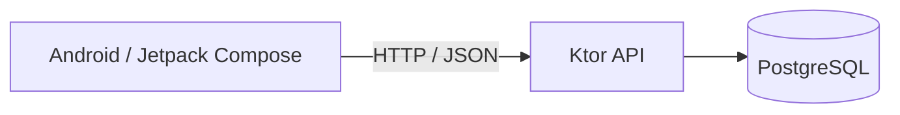

# kotlin-todo

Kotlinを学習しながら育てるTodoアプリ。Jetpack ComposeによるAndroidクライアント、Ktor API、PostgreSQLを1つのリポジトリで扱う。

このプロジェクトは、動く機能を増やすことに加えて、実装したコードと設計判断を自分の言葉で説明できる状態を目指す学習兼ポートフォリオプロジェクトである。

## 現在の方針

KtorバックエンドのTodo CRUDとOpenAPI生成までを完了した後、学習目標をKotlin / Androidへ集中するよう見直した。2027年前半まではAndroidクライアントを主な開発対象とし、バックエンドはAndroidから必要になる変更を除いて安定したAPI基盤として扱う。

バックエンドのテスト戦略再構築（旧Phase 4.11）や機能拡張は中止ではなく保留している。判断の背景は[ADR 0022](docs/decisions/0022-prioritize-android-client.md)、今後の順序は[プロジェクトロードマップ](docs/roadmap.md)を参照。

## 現在の進捗

- Androidプロジェクトを`android/`に追加
- 既存Ktor APIの`GET /todos`をRetrofitから呼び出し
- `Compose → ViewModel → StateFlow → Repository → Retrofit → Ktor API`のデータフローを構築
- APIから取得したTodoタイトルを`LazyColumn`で表示
- Loading / Success / Empty / Errorを型で分け、通信失敗時の再試行を追加

次はTodo詳細へ進む。Navigation、DI、テストは必要性が生じる順に追加する。

## システム構成

```text
kotlin-todo/
├── android/             # Jetpack Compose Androidクライアント
├── backend/             # Ktor + Exposedバックエンド
├── docs/                # 要件、Architecture、ADR、設計メモ、学習ジャーナル
└── docker-compose.yml   # PostgreSQL（開発用）
```



詳細は[architecture.md](docs/architecture.md)を参照。

## 技術スタック

### Android

- Kotlin 2.2
- Jetpack Compose + Material 3
- ViewModel / Coroutines / StateFlow
- Retrofit 3 + OkHttp
- kotlinx.serialization

### Backend

- Kotlin 2.4 / JDK 25
- Ktor 3.5（HTTPサーバ、Nettyエンジン、OpenAPI仕様の生成）
- Exposed 0.61（Kotlin製SQL DSL）
- PostgreSQL 17 / Flyway 11 / HikariCP 6
- kotlinx.serialization / Konform 0.11 / Logback 1.5
- JUnit 5 / Testcontainers / ktor-server-test-host

## 開発環境

Windows 11上で、用途に合わせて2つのcloneを使う。

- WSL2側のclone: Backend、Docker、ドキュメント確認
- Windows側のclone: Android Studio、Android Emulator、Androidビルド

同じGitHubリポジトリをcloneしているため、論理的なモノレポ構成は維持される。Windows版GradleをWSLのUNCパス上で実行するとファイルロックに失敗するため、AndroidプロジェクトはWindowsファイルシステム上で扱う。

## 起動

### Backend

WSL2で実行する。

```bash
docker compose up -d postgres
cd backend
./gradlew run
```

Ktorは`http://0.0.0.0:8080`で待ち受ける。

```bash
curl http://localhost:8080/health
curl http://localhost:8080/todos
```

Swagger UIは<http://localhost:8080/swagger>、OpenAPI JSONは<http://localhost:8080/openapi.json>で確認できる。

### Android

Windows側のcloneにある`android/`をAndroid Studioで開き、Android Emulatorで実行する。

現在のdebug用ベースURLにはWSL2のIPアドレスを使用している。WSL2を再起動するとIPが変わる可能性があるため、その場合はPowerShellで確認して`ApiClient.kt`を更新する。

```powershell
wsl -d Ubuntu -- hostname -I
```

これは暫定運用であり、ベースURLの外部設定化は後続Issueで扱う。

## ビルドとテスト

Backend:

```bash
cd backend
./gradlew test
```

Android（Windows PowerShell）:

```powershell
cd android
.\gradlew.bat :app:assembleDebug
```

Androidの自動テストは後続フェーズで追加する。現在はdebugビルドとエミュレータでの手動確認を行っている。

## ドキュメント

- [requirements.md](docs/requirements.md) — 何を作るか
- [roadmap.md](docs/roadmap.md) — どの順序で進めるか
- [architecture.md](docs/architecture.md) — どう構成するか
- [design-notes/](docs/design-notes/) — 機能実装前の設計意図
- [journal/](docs/journal/) — 実装後の学びと設計との差分
- [decisions/](docs/decisions/) — 重要な設計判断（ADR）
