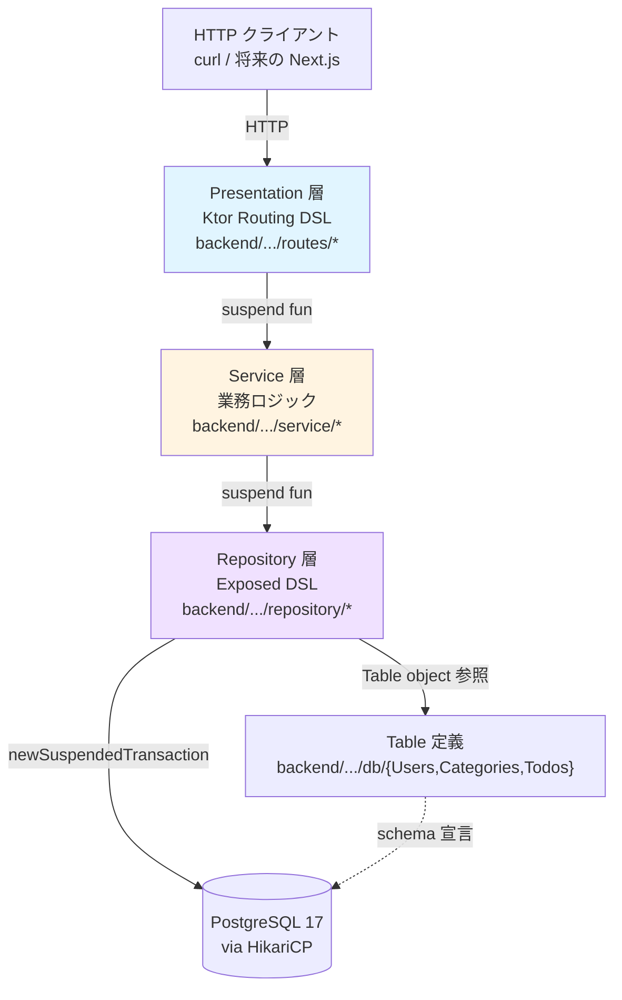
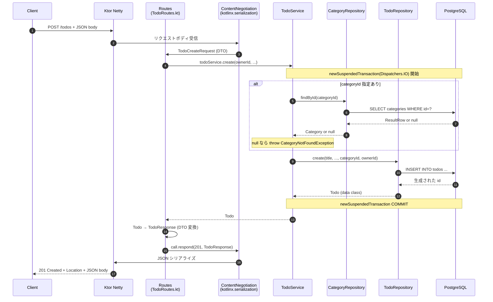
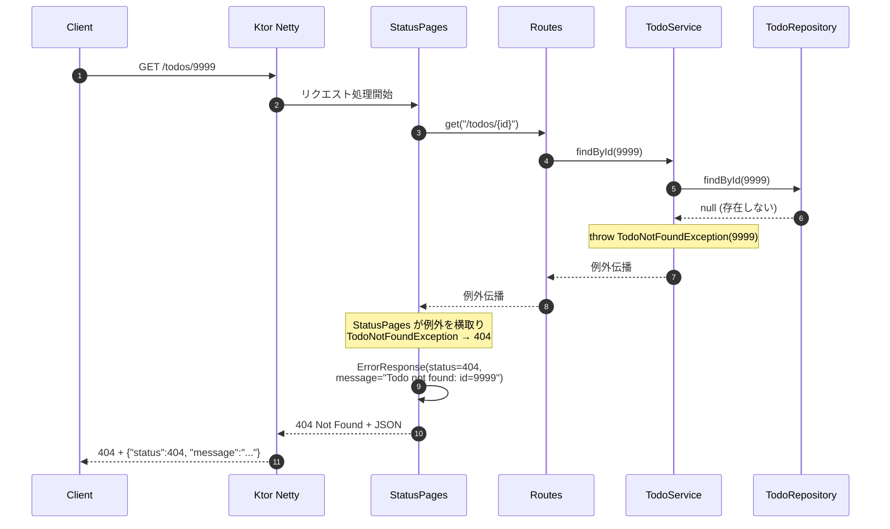

# アーキテクチャ設計

**バージョン**: 0.1（Phase 4.9 (a) 完了時点）
**最終更新**: 2026-08-12

このドキュメントは kotlin-todo バックエンドの **システム全体構成・レイヤー・依存・データフロー・エラー処理フロー** の一次ソース。「何を作るか」は [requirements.md](requirements.md)、実装の詳細は各 Phase の [journal](journal/) と [design-notes](design-notes/)、個別の設計判断は [decisions (ADR)](decisions/) を参照。

---

## 1. 技術スタック

### バックエンド

| レイヤー | 採用技術 | バージョン | 選定 ADR |
|---|---|---|---|
| Web フレームワーク | **Ktor** (server-netty) | 3.2.0 | [ADR 0008](decisions/0008-migrate-from-spring-to-ktor.md) |
| HTTP エンジン | **Netty** | 4.2.x（Ktor BOM 経由） | ADR 0008 |
| ORM / SQL ライブラリ | **Exposed** (DSL API) | 0.61.0 | [ADR 0015](decisions/0015-exposed-dsl-over-dao.md) |
| DB 接続プール | **HikariCP** | 6.2.1 | — |
| DB マイグレーション | **Flyway** | 11.1.0 | [ADR 0011](decisions/0011-flyway-for-schema-management.md) |
| データベース | **PostgreSQL** | 17 | [ADR 0010](decisions/0010-db-migration-before-framework-swap.md) |
| JSON シリアライズ | **kotlinx.serialization** | 2.3.21 | — |
| 依存注入 | **手動 DI** (Application.module() で組み立て) | — | [ADR 0014](decisions/0014-manual-di-over-koin.md) |
| ロギング | **Logback + SLF4J** | 1.5.16 | — |
| バリデーション | **Konform**（Phase 4.9 (c) で導入予定） | — | ADR 0016 予定 |
| 例外→HTTP マッピング | **Ktor StatusPages**（Phase 4.9 (c) で本格実装） | — | ADR 0017 予定 |
| テスト | **JUnit 5 + kotlin-test + Testcontainers** | 5.x + 1.20.4 | [ADR 0012](decisions/0012-testcontainers-for-integration-test.md) |

### 開発環境

| 項目 | 採用 | 備考 |
|---|---|---|
| ホスト OS | Windows 11 | — |
| 開発 OS | WSL2 (Ubuntu) | — |
| JDK | Amazon Corretto 25 (LTS) | SDKMAN 管理 |
| Kotlin | 2.3.21 | Spring Initializer 推奨版 |
| IDE | IntelliJ IDEA CE (Community) | 無料版 |
| Gradle | 9.x, Kotlin DSL | [ADR 0013](decisions/0013-kotlin-dsl-gradle.md) |
| DB 起動 | Docker Compose | `docker compose up -d postgres` |

---

## 2. レイヤー構成

Todo API は 3 層 + DB の構成。全てのリクエストは **上→下** の方向にのみ依存が流れる（依存の逆流なし）。



### 各層の責務

**Presentation 層（Ktor Routing）**
- HTTP リクエストの受付、パス / メソッドのルーティング
- リクエストボディの DTO へのデシリアライズ（kotlinx.serialization）
- レスポンス DTO のシリアライズ + HTTP ステータス設定
- 例外の StatusPages 経由での HTTP 変換（Phase 4.9 (c) で実装）
- **業務ロジックは書かない**（Service に委譲）
- **ファイル**: `backend/src/main/kotlin/com/example/kotlin_todo/routes/*.kt`（Phase 4.9 (b) で追加予定）

**Service 層（業務ロジック）**
- 複数 Repository を組み合わせる業務ルール（Category 存在確認 → Todo 作成など）
- カスタム例外の投出（`TodoNotFoundException`, `CategoryNotFoundException`）
- トランザクション境界の管理（複数 Repository 呼び出しを 1 トランザクションに束ねる）
- ADR 0006 の実装（delete が削除内容を返す）
- **HTTP に依存しない**（`ktor.*` を import しない）
- **ファイル**: `backend/src/main/kotlin/com/example/kotlin_todo/service/*.kt`

**Repository 層（データアクセス）**
- Exposed DSL による SQL 発行（`.insert`, `.selectAll().where`, `.update`, `.deleteWhere`）
- `ResultRow` → ドメイン data class への変換（`.toXxx()` 拡張関数）
- Enum ↔ String の境界変換（ADR 0001）
- `suspend fun` + `newSuspendedTransaction(Dispatchers.IO)` パターン
- **業務ルールは書かない**（Service 層の責務）
- **ファイル**: `backend/src/main/kotlin/com/example/kotlin_todo/repository/*.kt`

**Table 定義層（schema 宣言）**
- Exposed の `object Users : Table("users")` パターン
- `V1__init.sql` と 1:1 対応する schema 宣言（Exposed が DDL を発行するわけではない、schema の見方を Exposed に教える宣言）
- FK 関係、複合 UNIQUE、インデックスの宣言
- **ファイル**: `backend/src/main/kotlin/com/example/kotlin_todo/db/*.kt`

### ドメインクラス（レイヤー横断）

- `backend/src/main/kotlin/com/example/kotlin_todo/domain/*.kt`
- `data class User`, `Category`, `Todo` および `enum class Priority`, `TodoStatus`
- **全レイヤーで使う共通の値オブジェクト**
- **Exposed 依存無し**（`Table` を import しない、純粋な Kotlin data class）
- Service が返す型、Repository が返す型、Routing が受け取る型のすべて

---

## 3. モジュール構成（パッケージ構造）

```
backend/src/main/kotlin/com/example/kotlin_todo/
├── Application.kt          # エントリポイント (fun main, Application.module())
│                           # embeddedServer + Ktor プラグイン install + routing 組み立て
│
├── db/                     # DB 関連
│   ├── DatabaseFactory.kt  # HikariCP → Flyway.migrate() → Database.connect() の 3 段初期化
│   ├── Users.kt            # object Users : Table("users")
│   ├── Categories.kt       # object Categories : Table("categories")
│   └── Todos.kt            # object Todos : Table("todos")
│
├── domain/                 # ドメインクラス (Exposed 依存無し)
│   ├── User.kt             # data class User
│   ├── Category.kt         # data class Category
│   ├── Todo.kt             # data class Todo
│   ├── Priority.kt         # enum class Priority
│   └── TodoStatus.kt       # enum class TodoStatus
│
├── repository/             # Repository (手書きクラス、DSL API 使用)
│   ├── UserRepository.kt
│   ├── CategoryRepository.kt
│   └── TodoRepository.kt
│
├── service/                # Service (業務ロジック)
│   └── TodoService.kt
│
├── exception/              # カスタム例外 (RuntimeException 継承)
│   ├── TodoNotFoundException.kt
│   └── CategoryNotFoundException.kt
│
├── dto/                    # DTO (Phase 4.9 (b) で追加予定)
│   └── (TodoCreateRequest, TodoUpdateRequest, TodoResponse, ErrorResponse)
│
└── routes/                 # Ktor Routing 関数 (Phase 4.9 (b) で追加予定)
    └── (TodoRoutes.kt など)

backend/src/main/resources/
├── logback.xml             # ログ設定
└── db/migration/
    └── V1__init.sql        # Flyway 初期スキーマ

backend/src/test/kotlin/com/example/kotlin_todo/
├── AbstractPostgresTest.kt # Testcontainer 起動 + DatabaseFactory.init(...) の共通基底
├── repository/
│   ├── UserRepositoryTest.kt
│   └── TodoRepositoryTest.kt
└── service/
    └── TodoServiceTest.kt
```

### パッケージ命名の方針

- **snake_case は使わない**（Kotlin の慣習に反する）→ `com.example.kotlin_todo` のような **アンダースコア混じりは初期テンプレートの名残**、新規パッケージは `db`, `domain`, `service` などのフラットな camelCase
- **layer 名を第 1 セグメント**にする（`domain.Todo` ではなく `domain/Todo.kt`）
- **1 ファイル 1 主要クラス**（拡張関数など補助は同ファイル内で OK）

---

## 4. データフロー（HTTP リクエスト → レスポンス）

**例: `POST /todos` （Todo 作成）** のリクエスト処理シーケンス（Phase 4.9 (b) 完了時点の想定）。



**要点**:

- **Routing は業務判断をしない**: 受け取った DTO の値をそのまま Service に渡すだけ
- **Service で 1 トランザクション**: 複数 Repository 呼び出し（Category 存在確認 + Todo 作成）が 1 つのトランザクションに束ねられる → check-and-act の原子性
- **Repository の内側 `newSuspendedTransaction` は外側を再利用**（Exposed の nested transaction 挙動）
- **Suspend chain**: HTTP ハンドラ → Service → Repository → DB クエリ、すべて `suspend`。DB 待ちの間 Netty のスレッドは他のリクエストに使い回される

---

## 5. エラー処理フロー

例外がどの層で発生し、どう伝播し、最終的にどう HTTP レスポンスに変換されるか。以下のシーケンス（`TodoNotFoundException` → 404）は Phase 4.9 (b) で実装する。



### 例外のカテゴリと HTTP 対応（Phase 4.9 (b)〜(c) で実装）

| 例外の種類 | どこで発生 | HTTP ステータス | レスポンスボディ | 実装 |
|---|---|---|---|---|
| `TodoNotFoundException` | Service (findById, update, delete) | 404 Not Found | `ErrorResponse(status=404, message)` | (b) |
| `CategoryNotFoundException` | Service (create, update) | 404 Not Found | 同上 | (b) |
| Konform バリデーション失敗 | Routes（Konform で検証時） | 400 Bad Request | `ErrorResponse(status=400, message, fieldErrors)` | (c) |
| `SerializationException` | ContentNegotiation（JSON parse 失敗） | 400 Bad Request | `ErrorResponse(status=400, message)` | (c) |
| その他予期しない `Throwable` | 任意の層 | 500 Internal Server Error | `ErrorResponse(status=500, message="Internal server error")`（詳細はログのみ） | (c) |

**サブフェーズ分割の基準**: (b) 完了時点で「CRUD が正しく動く API」、(c) 完了時点で「不正な入力に正しく応答する API」になるよう分けている。リソース不在（404）は CRUD の正しさの一部とみなして (b) に含め、入力検証（400 系）を (c) にまとめた。

**`ErrorResponse` の段階的な拡張**: (b) では `status` + `message` の 2 フィールド。バリデーションのフィールド別エラーを表す `fieldErrors` は (c) で追加する。

**例外ではない 400**: パスパラメータが数値でない場合（例: `GET /todos/abc`）は例外ではなく読み取り失敗のため、StatusPages ではなく Routes 層の分岐（`toLongOrNull() ?: 400`）で処理する。(b) で実装。

### 例外設計の方針

- **カスタム例外は `RuntimeException` 継承**（unchecked）: 呼び出し側で try/catch を強制しない → StatusPages が横取りする設計
- **例外オブジェクトに情報を含める**: `val id: Long` などのプロパティで「何が起きたか」を StatusPages が抽出できる
- **メッセージは日本語ではなく英語**: ログ・スタックトレースで読みやすさ優先、ユーザー向けメッセージは Routing 層で日本語化する余地あり（現状は英語のまま返す）
- **例外を throw する層 = Service**: Repository は null を返す、Service で「null → 例外」変換（Elvis 演算子 `?:`）

---

## 6. トランザクション境界

Exposed の transaction 挙動と、本プロジェクトでの使い分け。

### `newSuspendedTransaction` の nested 挙動

- 外側でトランザクションが開いていれば、内側の `newSuspendedTransaction` は **外側を再利用**（新しい BEGIN しない）
- 外側が無ければ、内側で新規 BEGIN
- COMMIT / ROLLBACK は **最も外側のブロックが終了する時**に発生

### 各層でのトランザクション wrap 方針

| 層 | 単一 Repository 呼び出し | 複数 Repository 呼び出し |
|---|---|---|
| Routing (Phase 4.9 (b)) | wrap しない（Service に委譲） | 同左 |
| Service | wrap しない（Repository の内側 wrap で完結） | **`newSuspendedTransaction(Dispatchers.IO)` で wrap** |
| Repository | **メソッド内部で常に wrap**（`newSuspendedTransaction(Dispatchers.IO) { ... }`） | — |

### なぜ Repository は必ず wrap するか

- Repository を Service なしで直接呼ぶケース（テスト、Application.module() の初期化ブロック）でも動くように
- 冗長な wrap でも Exposed が外側を再利用するので実害なし
- 「Repository は常に単独で動く」保証を設計として持つ

### なぜ Service で複数 Repository 呼び出しを wrap するか

- **check-and-act の原子性**: 「Category 存在確認 → Todo 作成」の間に Category が削除される TOCTOU 回避
- Repository の内側 wrap は外側 Service の transaction に合流するので、全体で 1 トランザクション

---

## 7. テスト戦略

### 現状（Phase 4.9 (a) 時点）

- **Repository テスト** (5): 実 PostgreSQL に対して CRUD の挙動確認、FK CASCADE / SET NULL の動作確認
- **Service テスト** (5): 業務ロジック（例外投出、複数 Repository の組み合わせ）を実 PostgreSQL 上で確認
- **Ktor テスト**: まだ無し（Phase 4.9 (b) で routes が入ってから）
- **カバレッジ計測**: まだ導入していない

### Testcontainers による共有 PostgreSQL

`AbstractPostgresTest` の `companion object` で JVM 内に 1 つだけ Testcontainer PostgreSQL を起動、全テストで共有。

```
JVM 起動時
   ↓
AbstractPostgresTest クラスロード
   ↓
companion object 初期化
   ↓
PostgreSQLContainer("postgres:17").apply { start() }
DatabaseFactory.init(HikariDataSource(...))
   ↓
テスト実行
   ↓
@BeforeEach で TRUNCATE 相当（Todos → Categories → Users の順に deleteAll）
   ↓
各 @Test 実行（Repository / Service 経由で DB 操作）
   ↓
JVM 終了時に Testcontainer 自動停止
```

### Phase 4.11 で予定している拡張

- **Ktor `testApplication` による HTTP 経由テスト**（Routing + Service + Repository を通貫）
- **ON DELETE CASCADE の実挙動テスト**（現状 SET NULL のみ検証済み）
- **Konform バリデーション失敗パスのテスト**
- **エラーレスポンス (404, 400, 500) の StatusPages マッピングテスト**

---

## 8. 設定管理

### 現状

- **DB 接続情報**: `DatabaseFactory.kt` にハードコード（`jdbc:postgresql://localhost:5432/kotlin_todo` + user/pass）
- **Ktor サーバー設定**: `Application.kt` にハードコード（port=8080, host="0.0.0.0"）
- **ログ設定**: `backend/src/main/resources/logback.xml`（構造化ログの基本設定）
- **Flyway 設定**: DatabaseFactory 内でコード化（`.dataSource(...).load().migrate()`）

### Phase 6 (認証実装) で改善予定

- Ktor の `application.conf`（HOCON 形式）or 環境変数への外部化
- production 化を意識した secret 管理（平文パスワードを消す）

---

## 9. 将来の拡張

### 直近の Phase での追加要素

| Phase | 追加されるもの |
|---|---|
| Phase 4.9 (b) | `dto/`, `routes/`, `DevDataInitializer.kt`（固定ユーザー）、Application.module() の DI 組み立て |
| Phase 4.9 (c) | `konform` 依存、DTO へのバリデーション定義、StatusPages 例外マッピング、ADR 0016/0017 |
| Phase 4.10 | Ktor OpenAPI プラグイン or 手書き openapi.yaml + Swagger UI |
| Phase 4.11 | `ktor-server-test-host` によるテスト刷新、CASCADE テスト追加 |

### Phase 5 以降で追加される予定のもの（要件書 §4 参照）

- Todo のフィルタ / ソート / 検索 / ページネーション
- Category CRUD API
- 認証機能（Phase 6、JWT or Session）
- Next.js フロントエンド（Phase 6 完了後、`frontend/` パッケージ）

---

## 10. 関連ドキュメント

- [requirements.md](requirements.md) — 何を作るか（機能要件・非機能要件・スコープ外）
- [db-schema.md](db-schema.md) — DB スキーマ設計（ER 図・テーブル定義）
- [decisions/](decisions/) — 個別の設計判断 (ADR)
- [journal/](journal/) — 各 Phase の学習記録
- [design-notes/](design-notes/) — Phase 実装前の詳細設計メモ（Phase 4.9 (b) 以降で運用開始）
- プラン file: `~/.claude/plans/pc-springboot-kotlin-ktor-mac-giggly-key.md`（ローカル参照）
