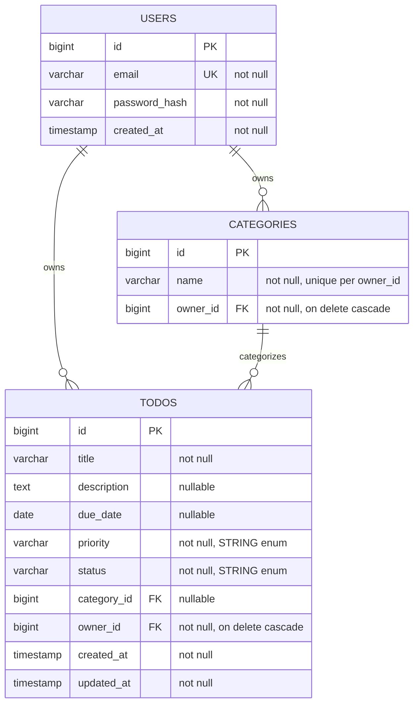

# DBスキーマ設計

Phase 3（JPA/Hibernateでのドメインモデリング）でEntityを書く前に固定した設計。Kotlin EntityはここでのテーブルCASCADE定義に1:1で対応させる。Phase 8でFlywayマイグレーション（`V1__init.sql`）を書く際もこの設計を正とする。

## ER図

## テーブル定義

### `users`

| カラム | 型 | 制約 |
|---|---|---|
| id | BIGINT | PK, IDENTITY |
| email | VARCHAR(255) | NOT NULL, UNIQUE |
| password_hash | VARCHAR(255) | NOT NULL |
| created_at | TIMESTAMP | NOT NULL |

### `categories`

| カラム | 型 | 制約 |
|---|---|---|
| id | BIGINT | PK, IDENTITY |
| name | VARCHAR(100) | NOT NULL |
| owner_id | BIGINT | FK → users.id, NOT NULL, ON DELETE CASCADE |

- 複合UNIQUE制約: `(owner_id, name)` — [ADR 0003](decisions/0003-category-name-unique-per-owner.md)

### `todos`

| カラム | 型 | 制約 |
|---|---|---|
| id | BIGINT | PK, IDENTITY |
| title | VARCHAR(200) | NOT NULL |
| description | TEXT | NULL |
| due_date | DATE | NULL |
| priority | VARCHAR(20) | NOT NULL（`Priority` enum、STRING保存 — [ADR 0001](decisions/0001-enum-storage-as-string.md)） |
| status | VARCHAR(20) | NOT NULL（`TodoStatus` enum、STRING保存） |
| category_id | BIGINT | FK → categories.id, NULL |
| owner_id | BIGINT | FK → users.id, NOT NULL, ON DELETE CASCADE |
| created_at | TIMESTAMP | NOT NULL |
| updated_at | TIMESTAMP | NOT NULL |

## インデックス方針（Phase 5のフィルタ/ソート/検索を見越して）

- `todos.owner_id` — 全クエリが必ず所有者でスコープされるため（単独インデックス、複合の先頭にも使われる）
- `todos(owner_id, status)` — 複合インデックス。「自分のTodoをステータスで絞る」が最頻出クエリになる想定
- `todos.due_date` — 期限順ソート用
- `users.email` — UNIQUE制約が自動でインデックスを兼ねる（ログイン時の検索）
- タイトル/説明の全文検索はMVPでは`LIKE`検索で十分とし、専用の検索インデックス（Postgresの`GIN`/`tsvector`等）はストレッチ機能として保留

## 関連する設計判断

- [0001 - enumはORDINALではなくSTRINGでDB保存する](decisions/0001-enum-storage-as-string.md)
- [0002 - Userを削除したら関連するTodo/CategoryもCASCADE削除する](decisions/0002-cascade-delete-on-user.md)
- [0003 - Category名はユーザーごとに一意にする](decisions/0003-category-name-unique-per-owner.md)
